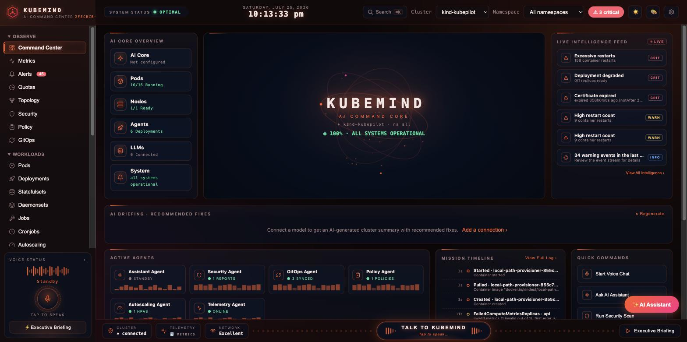
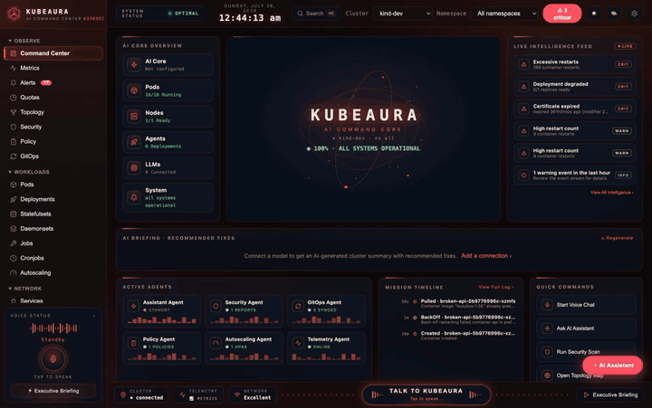
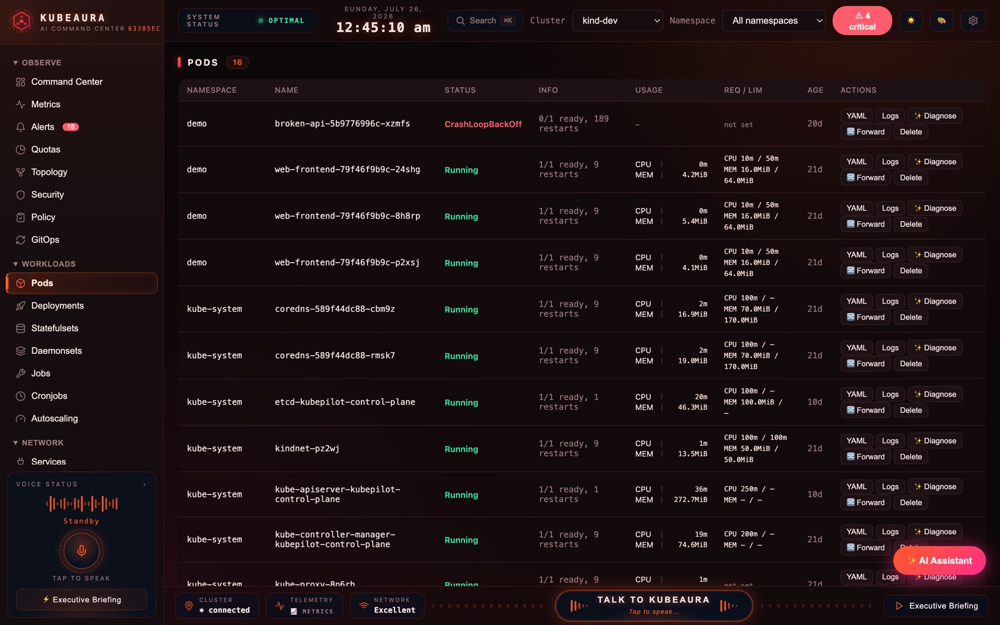
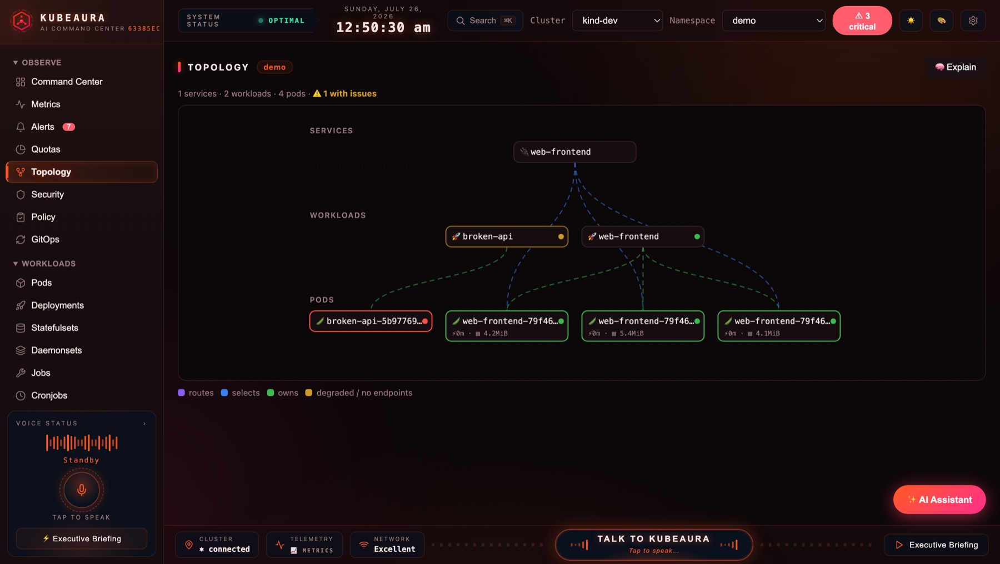
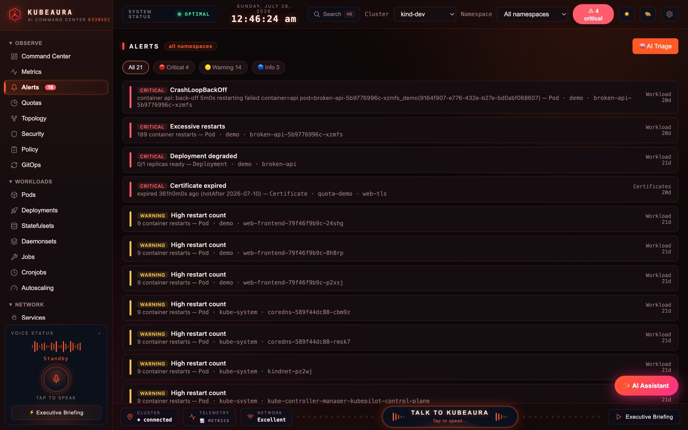

<div align="center">

<picture>
  <source media="(prefers-color-scheme: dark)" srcset="assets/logo-dark.svg">
  
</picture>

**An AI-assisted Kubernetes cockpit you run yourself — one binary, your kubeconfig, zero setup.**

[](CHANGELOG.md)
[](LICENSE)
[](go.mod)
[](CONTRIBUTING.md)

</div>

---

KubeAura is a single, self-contained binary in the spirit of k9s, Lens,
and Headlamp — you already have a kubeconfig, so you just run it and see your
clusters. No server to deploy, no database, nothing to host, and nothing
leaves your machine unless you point the AI at a hosted model.

```bash
kubeaura        # reads your current kube context, opens http://127.0.0.1:7654
```

<div align="center">
  
</div>

**Highlights**

- 🖥️ **Full cluster cockpit** — command-center dashboard, metrics heatmaps, alert triage, topology graph, quota dashboard, 19 resource kinds with logs / exec / YAML diff-apply
- 🧠 **AI Assistant** (pluggable: Anthropic, Ollama-local, any OpenAI-compatible) — diagnose pods, explain architecture, review YAML, summarize logs
- 🎙️ **Talk to KubeAura** — a voice assistant available on every view: ask questions aloud, get spoken answers grounded in live cluster state, and issue commands ("scale web-frontend to 3") with confirmation gating
- 🪟 **Native desktop app** — the same binary opens as a desktop window on macOS, Windows, or Linux (system webview, no Electron)
- 🔌 **Ecosystem-aware, detect-don't-install** — lights up Security (Trivy Operator CVEs), Policy (Kyverno/OPA reports), GitOps (Argo CD + Flux sync), Autoscaling (HPA + KEDA), and cert-manager expiry alerts *when those CRDs exist*, degrades gracefully when they don't
- 🎨 **Dark & light glass UI** in the KubeAura brand palette with keyboard-first navigation (⌘K omnibox)
- 🔒 **RBAC-honest** — actions you can't perform are greyed out, forbidden reads degrade per-panel instead of breaking the page
- 🛡️ **Loopback by default** — binds `127.0.0.1`, refuses cross-origin and rebinding requests, and never writes your API keys to disk

---

## Table of contents

- [Installation](#installation)
- [Quick start](#quick-start)
- [Desktop app (macOS / Windows / Linux)](#desktop-app-macos--windows--linux)
- [Turn on the AI Assistant](#turn-on-the-ai-assistant-optional)
- [A tour of the UI](#a-tour-of-the-ui)
- [AI features](#ai-features-the-differentiator)
- [Voice commands guide](#voice-commands-guide)
- [Keyboard shortcuts](#keyboard-shortcuts)
- [Configuration](#configuration-environment-variables)
- [Security & permissions](#security--permissions)
- [Architecture](#architecture)
- [Run a shared instance in-cluster](#run-a-shared-instance-in-cluster-optional)
- [Roadmap](#roadmap)
- [Versioning & releases](#versioning--releases)
- [Contributing](#contributing)

**Website:** [devganeshg.github.io/kubeaura](https://devganeshg.github.io/kubeaura/)

---

## Installation

KubeAura is a single binary for Linux, macOS, and Windows. Every release
publishes archives plus a `checksums.txt` on the
[releases page](https://github.com/devganeshg/kubeaura/releases).

### macOS

```bash
# Downloads, verifies the checksum, installs to /usr/local/bin
curl -sSfL https://raw.githubusercontent.com/devganeshg/kubeaura/main/scripts/install.sh | sh
```

### Linux

```bash
# /usr/local/bin if writable, otherwise ~/.local/bin
curl -sSfL https://raw.githubusercontent.com/devganeshg/kubeaura/main/scripts/install.sh | sh
```

### Windows

Download the `.zip` from the [releases page](https://github.com/devganeshg/kubeaura/releases)
and put `kubeaura.exe` anywhere on your `PATH`.

### Container

```bash
docker run --rm -p 7654:7654 \
  -v ~/.kube:/home/nonroot/.kube:ro \
  ghcr.io/devganeshg/kubeaura
```

Then open <http://127.0.0.1:7654>. Multi-arch (amd64 + arm64), distroless,
runs as non-root. Also on Docker Hub as `devganeshg/kubeaura` — `ghcr.io` has
no pull rate limits, so prefer it if you hit one.

> **If your cluster is local (kind, minikube, k3d), this will not connect.**
> Their kubeconfigs point at `127.0.0.1:<port>`, and inside a container that
> means the container itself. Either run the binary directly — which is the
> better experience anyway — or, on Linux, share the host network:
>
> ```bash
> docker run --rm --network host -v ~/.kube:/home/nonroot/.kube:ro \
>   ghcr.io/devganeshg/kubeaura
> ```
>
> On macOS and Windows, Docker Desktop has no host network, so point the
> kubeconfig at `host.docker.internal` instead. The container is most useful
> for **remote** clusters (EKS, GKE, AKS) and for running in-cluster — for
> which the [Helm chart](#run-a-shared-instance-in-cluster-optional) is the
> supported path.

### With Go installed

```bash
go install github.com/devganeshg/kubeaura/cmd/kubeaura@latest
```

### Building from source

KubeAura builds with the Go version in [`go.mod`](go.mod) (1.26+). The web UI
is embedded with `go:embed`, so there is no Node, npm, or bundler step.

```bash
git clone https://github.com/devganeshg/kubeaura.git
cd kubeaura
make build && ./bin/kubeaura
```

`make install` additionally packages and installs `/Applications/KubeAura.app`
on macOS (needs the Xcode Command Line Tools: `xcode-select --install`). See
[Desktop app](#desktop-app-macos--windows--linux) for Windows and Linux
packaging.

### Verifying a download

```bash
sha256sum -c checksums.txt --ignore-missing     # shasum -a 256 on macOS
```

> **macOS Gatekeeper:** binaries and the `.app` bundle are not yet
> notarized, so macOS may report the app as "damaged" or refuse to open it.
> Clear the download quarantine flag once:
>
> ```bash
> xattr -dr com.apple.quarantine /Applications/KubeAura.app   # or the binary
> ```

### In a cluster

For a shared instance behind your own authentication, see
[Run a shared instance in-cluster](#run-a-shared-instance-in-cluster-optional).

> Homebrew and Scoop packaging is wired up in
> [`.goreleaser.yaml`](.goreleaser.yaml) but not yet enabled — see
> [docs/RELEASING.md](docs/RELEASING.md) if you want to turn it on.

---

## Quick start

You need access to a cluster — if `kubectl` works for you, KubeAura works.

```bash
kubeaura                  # reads your current context, opens http://127.0.0.1:7654
kubeaura --desktop        # same thing in a desktop window
kubeaura --help           # every flag and environment variable
```

That's it. KubeAura uses **your existing kubeconfig** and only the permissions
your current credentials already have — it can do exactly what you can do with
`kubectl`, no more. Switch clusters from the **Cluster** dropdown in the header
(it lists every context in your kubeconfig), or start on a specific one with
`kubeaura --context staging`.

Two optional next steps:

```bash
kubeaura config init      # write a commented config file you can keep
```

…and [turn on the AI assistant](#turn-on-the-ai-assistant-optional), which is
off until you point it at a model.

> **What to expect from `--desktop`:** if Chrome/Edge is installed, KubeAura
> opens in a **Chromium app-mode window** — a standalone desktop window with no
> tabs or address bar. Because Chrome renders that window, **the Dock shows the
> Chrome icon**, which can look like "it opened in the browser". It didn't —
> it's a dedicated app window, and this mode is preferred because voice input
> only works in Chromium. To get a native window with the KubeAura Dock icon
> instead (voice input won't work there), see
> [Desktop app](#desktop-app-macos--windows--linux).

> **Tip:** live CPU/memory charts, heatmaps, and the inline pod metrics need
> [metrics-server](https://github.com/kubernetes-sigs/metrics-server) installed
> in the cluster. Everything else works without it; KubeAura detects it
> automatically and hides the usage panels when it's absent.

---

## Desktop app (macOS / Windows / Linux)

KubeAura can run as a **desktop window** instead of a browser tab. Desktop
mode picks the best window it can find:

1. **Chrome / Edge / Chromium app mode** (preferred) — a chromeless desktop
   window with the full Web Speech API, so **voice input works in the desktop
   app**. Used automatically when a Chromium-family browser is installed.
   Note: because Chrome renders the window, **the Dock/taskbar shows the
   Chrome icon**, not KubeAura's — it's still a standalone app window (no
   tabs, no address bar), not a browser tab.
2. **Native system webview** (WKWebView / WebView2 / WebKitGTK via
   [webview_go](https://github.com/webview/webview_go)) — a truly native
   window with the KubeAura Dock icon. Used as the fallback when no Chromium
   browser exists; voice *output* only (the Web Speech API isn't available, so
   the microphone won't work). Requires the opt-in build tag `desktop` (the
   default binary stays CGO-free). Set `KUBEAURA_WEBVIEW=1` to force this
   even when Chrome is installed.

No Electron, no Node, nothing extra to ship either way.

**macOS** (needs the Xcode Command Line Tools: `xcode-select --install`):

```bash
make install                    # builds + installs /Applications/KubeAura.app
# (make install-app is the same thing) — or just package without installing:
make app && open dist/KubeAura.app
```

Or run the window straight from the terminal:

```bash
make run-desktop
# or manually:
make desktop                    # CGO build with -tags desktop
./bin/kubeaura --desktop
```

**Windows** — package a ready-to-share zip from any machine with Go (no
Windows box needed):

```bash
make app-windows                # → dist/KubeAura-windows-amd64.zip
```

Unzip on the Windows machine and double-click `KubeAura.bat`. The window
opens via Chrome/Edge app mode (Edge ships with Windows 10/11). To instead
build the native-webview variant *on* Windows (needs a C compiler such as
[MSYS2/MinGW-w64](https://www.msys2.org/), and the
[WebView2 runtime](https://developer.microsoft.com/microsoft-edge/webview2/) —
preinstalled on Windows 11):

```powershell
$env:CGO_ENABLED=1
go build -tags desktop -o kubeaura.exe ./cmd/kubeaura
.\kubeaura.exe --desktop
```

**Linux** — package a tarball with an installer from any machine with Go:

```bash
make app-linux                  # → dist/kubeaura-linux-amd64.tar.gz  (ARCH=arm64 supported)
```

Extract on the Linux machine and run `./install.sh` — it installs the binary
to `~/.local/bin` plus an app-menu entry and icon. The window opens via
Chrome/Chromium app mode. To instead build the native-webview variant *on*
Linux (needs GTK and WebKitGTK dev packages):

```bash
# Debian/Ubuntu:
sudo apt install build-essential libgtk-3-dev libwebkit2gtk-4.1-dev
CGO_ENABLED=1 go build -tags desktop -o bin/kubeaura ./cmd/kubeaura
./bin/kubeaura --desktop
```

Run it without `--desktop` and the same binary behaves exactly like the normal
server (`KUBEAURA_DESKTOP=1` also enables the window — that's how the .app
bundle does it). If the default port is taken, the desktop app quietly picks a
free one instead of failing. `make app-all` packages all three OSes into
`dist/` in one go; prebuilt desktop artifacts are also produced by the
[Desktop builds workflow](.github/workflows/desktop.yml)
(run it from the Actions tab, or tag a release).

Two desktop-specific notes:

- The app doesn't inherit your shell's environment when launched from
  Finder/Explorer — configure the AI from inside the app instead: **✨ Assistant →
  ⚙ Model Connections → add Ollama (or any backend) → Activate**.
- Voice input works in the desktop window when it opened via Chrome/Edge app
  mode (allow the microphone on first use). Only the native-webview fallback
  lacks speech recognition — there, open the printed `http://localhost:…` URL
  in Chrome for the mic; spoken answers work everywhere.

---

## Turn on the AI Assistant (optional)

The Assistant is **model-agnostic**. Use a hosted API, a local model, or any
OpenAI-compatible server. Everything except the AI features works without it.

| You want…                        | Set these before running                            | Notes                                                                            |
| -------------------------------- | --------------------------------------------------- | -------------------------------------------------------------------------------- |
| **Hosted Claude**                | `ANTHROPIC_API_KEY=sk-ant-…`                        | Highest quality.                                                                 |
| **Fully local (Ollama)**         | `KUBEAURA_AI_PROVIDER=ollama`                      | Nothing leaves your machine. Run `ollama serve` and `ollama pull <model>` first. |
| **Any OpenAI-compatible server** | `KUBEAURA_AI_PROVIDER=openai`, `OPENAI_BASE_URL=…` | Works with LocalAI, LM Studio, vLLM, llama.cpp, OpenRouter, Groq, OpenAI.        |

**Example — fully local with Ollama:**

```bash
ollama serve &
ollama pull llama3.2                 # or qwen2.5:3b, phi3, mistral, …
export KUBEAURA_AI_PROVIDER=ollama
export KUBEAURA_AI_MODEL=llama3.2   # optional; llama3.2 is the default
kubeaura
```

**Example — OpenAI-compatible endpoint:**

```bash
export KUBEAURA_AI_PROVIDER=openai
export OPENAI_BASE_URL=http://localhost:1234/v1   # your server; should end in /v1
export OPENAI_API_KEY=…                            # optional for local servers
export KUBEAURA_AI_MODEL=your-model-id
kubeaura
```

If `KUBEAURA_AI_PROVIDER` is unset, KubeAura **auto-detects**: Anthropic if a
key is present, then an OpenAI-compatible server, then Ollama. The active backend
is shown in the Assistant panel header and the startup banner.

### Add or switch models from the UI — no restart

Open the Assistant (✨ button, bottom-right) and click the **⚙ gear** (or the model
chip) to open **Model Connections**. There you can:

- **Add** any number of backends (Ollama / OpenAI-compatible / Anthropic),
- click **Discover** to list a server's installed models and pick one,
- **Activate** the one you want, **Test** it, or **Remove** it.

Connections live in memory only — **API keys are never written to disk**.

> **Model quality note:** tiny local models (0.5B–3B) are great for quick natural-language
> queries but can be rough at strict YAML generation. For cleaner manifests and
> reviews, use a 7B+ instruct model or a hosted model.

---

## A tour of the UI

<div align="center">
  
</div>

<table>
<tr>
<td width="50%"></td>
<td width="50%"></td>
</tr>
<tr>
<td><b>Pods</b> — live CPU/memory inline, a Req/Lim column that turns red near a limit, and YAML / Logs / Diagnose / Forward on every row.</td>
<td><b>Topology</b> — Ingress → Service → Workload → Pod, with replica health and <code>NoEndpoints</code> detection.</td>
</tr>
<tr>
<td colspan="2"></td>
</tr>
<tr>
<td colspan="2"><b>Alerts (Pulse)</b> — everything wrong in one triage list: crashloops, restart storms, degraded workloads, expiring certificates. Filter by severity, click through to the resource.</td>
</tr>
</table>


The UI is a **command-center shell**: the left sidebar carries navigation plus
a **voice dock** (tap-to-speak mic, live voice status, ⚡ Executive Briefing),
the header shows a live **system-status chip** (OPTIMAL / DEGRADED / CRITICAL),
ship clock, **cluster switcher**, **namespace filter**, and **🔍 Search (⌘K)**;
the footer dock has cluster/telemetry/network chips and the **TALK TO
KUBEAURA** bar.

The theme uses the KubeAura logo gradient (**#ff4000 → #ff0072**) over a warm
charcoal glass style, with a light theme available (toggle in the header).
Sidebar navigation is **parent-child**: collapsible groups whose expand state
persists across sessions, ordered Observe → Workloads → Network → Platform →
Config → Cluster → Access → Operate.

### Core views (Observe)

| View               | What it does                                                                                                                                                                                                                                                     |
| ------------------ | ---------------------------------------------------------------------------------------------------------------------------------------------------------------------------------------------------------------------------------------------------------------- |
| **Dashboard**      | The **Command Center**: AI core overview, live intelligence feed, active agents, mission timeline, quick commands, and system-monitor rings — plus pod-phase and deployment-health charts, a 12-hour event timeline, a restart leaderboard, and a live alerts panel. |
| **Fleet**          | **Every kubeconfig context at once**, queried in parallel: reachability, server version, API latency, node/pod health and alert counts per cluster, with fleet-wide totals. A context that will not connect shows its error instead of blanking the page. Click a row to make it active. |
| **Metrics**        | Node CPU/memory **heatmaps**, top pods by CPU/memory, a node utilization table, and per-service live resource levels. (needs metrics-server)                                                                                                                     |
| **Alerts (Pulse)** | One triage list of everything wrong: crashloops, OOMKills, degraded workloads, node pressure, failed jobs, unbound PVCs, recent warning events — plus **cert-manager certificates about to expire**. Filter by severity; click an alert to jump to the resource. |
| **Quotas**         | Per-namespace **ResourceQuota dashboard**: progress bars for pods / CPU / memory (requests and limits) vs. hard limits, peak-utilization summary cards, and near-limit highlighting.                                                                             |
| **Topology**       | Interactive **Ingress → Service → Workload → Pod** graph on a dot-grid canvas with workload replica health, `NoEndpoints` service detection, hover edge-highlighting, and node tooltips. **🧠 Explain** describes the architecture.                              |
| **Security**       | **Image CVE reports read from the Trivy Operator** (when installed): severity summary cards, severity-mix donut, most-exposed-workloads bars, and per-workload findings with fix versions.                                                                       |
| **Compliance**     | Image CVEs, policy results, and RBAC posture rolled into **one pass/fail verdict** against a configurable bar, **exportable as HTML, Markdown, CSV or JSON** for an auditor or a change ticket. A check that could not run is reported as *not checked* — never as a pass. |
| **Policy**         | **Compliance results from Kyverno / OPA PolicyReports**: pass/fail/warn/error cards, a compliance donut, violations-by-namespace bars, and expandable per-rule findings.                                                                                         |
| **GitOps**         | **Argo CD Application and Flux Kustomization/HelmRelease sync status**: engine detection, sync-state and per-engine donuts, and a problems-first app table with failure messages.                                                                                |

### Workloads & Operate

| View              | What it does                                                                                                                                                                              |
| ----------------- | ------------------------------------------------------------------------------------------------------------------------------------------------------------------------------------------ |
| **Autoscaling**   | **HPA status** (replicas min ≤ current → desired ≤ max, live metric utilization, at-max/scaling/inactive states, capacity-headroom bars) plus **KEDA ScaledObjects** with their triggers. |
| **Helm**          | Releases decoded from **Helm's own storage secrets** — chart and app version, revision history, the values you supplied merged over chart defaults, the rendered manifest, notes, the objects a release owns, and a **line diff between any two revisions**. All of that works with no `helm` binary present. When one *is* on your `PATH`, install / upgrade / rollback / uninstall appear too (with a dry-run first). |
| **Port Forwards** | Start, track, and stop port-forwards from one place (also a 🔀 button on Service/Pod rows).                                                                                               |
| **Audit**         | A record of every write action you made this session (apply, scale, restart, delete, exec, port-forward).                                                                                 |

The Security, Policy, GitOps, and KEDA views follow a **detect-don't-install**
pattern: KubeAura reads the relevant CRDs when they exist and shows a friendly
install hint when they don't. Helm follows the same stance from the other
direction — reading releases never needs anything installed, and the lifecycle
actions light up only when a `helm` binary is already on your `PATH`.

Helm's write actions are **loopback-only**. They run the `helm` binary on the
machine serving the UI, which can read charts and values from its filesystem —
harmless when that machine is yours, an arbitrary-file-read primitive on a
shared instance. A shared deployment (`KUBEAURA_ALLOW_REMOTE=1`) keeps the
read-only Helm views and refuses the rest.

### Browsing resources

The sidebar groups resource kinds under **Workloads, Network, Platform,
Config, Cluster, and Access** (RBAC). Pick a kind to list it; the namespace
filter and server-side pagination keep it fast on large clusters. The **Pods**
table shows **live CPU/memory bars** inline when metrics-server is present,
plus a **Req / Lim column** with each pod's summed container requests and
limits — highlighted red when live usage is within 90% of a limit (throttling
/ OOMKill risk).

**Click any row** to open the **detail drawer**, which has tabs:

- **Overview** — status, scheduling, containers, conditions, labels, and related events
- **YAML** — edit and apply, with **± Diff** (a `kubectl diff`-style dry-run) and **🧠 Review** (AI best-practice check)
- **Logs** (pods) — container picker, **regex filter**, level color-coding, live follow, **🧠 Summarize**, and **⊞ Compare** for multi-container pods
- **⌨ Exec** (pods) — run one-shot commands in a container
- **📊 Observability** (services) — backing pods with live CPU/memory levels

Actions you don't have permission for are **greyed out automatically** (checked
via `SelfSubjectAccessReview`).

### The Omnibox (⌘K)

Press **⌘K** (or **/**) anywhere for a command palette: fuzzy-jump to any view,
resource kind, or namespace — or type a question and pick **"🧠 Ask AI"** to send
it to the Assistant.

---

## AI features (the differentiator)

Every AI feature runs through whatever model backend you configured (hosted,
local, or OpenAI-compatible).

- **🎙️ Talk to KubeAura (voice)** — tap the mic in the sidebar dock or the
  **TALK TO KUBEAURA** bar on any view. You see a live transcript while you
  speak, the answer appears in a floating card right where you are (never a
  page change), and it's read aloud. **Conversation mode** reopens the mic
  after each spoken reply so a whole exchange stays hands-free — tap the mic
  again to stop. (Voice input needs Chrome/Edge; spoken answers work
  everywhere.)
- **🎖️ Command authority** — imperatives run the cluster: _"scale
  web-frontend to 3"_, _"restart broken-api"_, _"show logs for
  payments-worker"_. Mutations always read the plan back and wait for your
  explicit "yes, proceed"; ambiguous names offer a pick list.
- **⚡ Executive Briefing** — one click (footer or sidebar) for a spoken
  rundown: overall health, workloads at risk, notable alerts, and the top
  three actions to take.
- **Natural-language querying** — _"Why is my pod crashing?"_, _"Show failed
  deployments"_, _"Which services have no ingress?"_ — grounded in a live
  snapshot of your cluster, answered facts-first with exact resource names.
- **✨ Diagnose** — one click on any pod produces a Root Cause Analysis from its
  spec, events, and logs.
- **🧠 AI Triage** — on the Alerts view, turns every current alert into a
  prioritized, explained action plan.
- **🧠 Manifest Review** — in any YAML editor, checks correctness, security, and
  reliability against best practices.
- **🧠 Explain Topology** — describes how traffic flows through a namespace.
- **🧠 Summarize Logs** — distills raw container logs into a short summary of
  errors and likely causes.
- **Generate YAML** — describe a workload in plain English, get apply-ready YAML.

---

## Voice commands guide

Tap the **mic** in the sidebar voice dock (or the **TALK TO KUBEAURA** bar in
the footer) and just talk. You'll see a live transcript while you speak; the
answer appears in a floating card on whatever view you're on and is read
aloud. After each spoken reply the mic reopens automatically (**conversation
mode**) — tap the mic again to stop.

### Ask anything about the cluster

| Say…                                        | You get                                        |
| ------------------------------------------- | ----------------------------------------------- |
| _"How many pods are running?"_              | Live counts from the cluster snapshot           |
| _"Is anything broken?"_                     | Exact failing resources with likely causes      |
| _"Why is broken-api failing?"_              | Diagnosis grounded in status and events         |
| _"Which services have no endpoints?"_       | Named services with the issue                   |
| _"What's eating the most memory?"_          | Top consumers (needs metrics-server)            |

### Command the cluster

| Say…                                   | What happens                                                        |
| -------------------------------------- | -------------------------------------------------------------------- |
| _"Scale web-frontend to 3"_            | Reads the plan back, **waits for "yes, proceed"**, then scales       |
| _"Restart broken-api"_                 | Confirmation-gated rolling restart                                   |
| _"Show logs for web-frontend"_         | Last 100 lines in the answer card                                    |
| _"Yes, proceed"_ / _"No"_              | Confirms or cancels the pending command                              |

If a name matches several resources, KubeAura lists them and asks which one
you meant. **Mutations never run without your explicit confirmation.**

### If the mic doesn't work

- **"Voice input isn't available in this window"** — speech recognition only
  exists in **Chromium browsers** (Chrome/Edge). You'll only see this in the
  native-webview fallback or Safari; install Chrome and relaunch the desktop
  app (it will use a Chrome app window automatically), or open the printed
  `http://localhost:…` URL in Chrome and tap the mic there.
- **"Microphone is blocked"** — allow the mic via the **🔒 icon** in Chrome's
  address bar, and on macOS check **System Settings → Privacy & Security →
  Microphone** for your browser. Then reload.
- No sound? Check the **🔊 toggle** in the answer card / voice status, and your
  system output volume.

---

## Keyboard shortcuts

Press **?** in the app for this cheatsheet at any time.

| Key                     | Action                                                           |
| ----------------------- | ---------------------------------------------------------------- |
| `⌘K` / `/`              | Open the command palette (omnibox)                               |
| `d` `m` `a` `t` `q` `f` `u` | Go to Dashboard · Metrics · Alerts · Topology · Quotas · Forwards · Audit |
| `l` `y` `x` `o`         | In a pod drawer: Logs · YAML · Exec · Overview                   |
| `?`                     | Toggle the shortcuts help                                        |
| `esc`                   | Close the palette, drawer, or dialogs                            |

---

## Configuration

Nothing is required — KubeAura runs on your kubeconfig alone. Anything you do
want to set can come from three places, in this order of precedence:

**1. Command-line flags** (`kubeaura --help` lists them all)

```bash
kubeaura --context staging --addr 127.0.0.1:9000 --no-browser
kubeaura --ai-provider ollama --ai-model llama3.2
```

**2. Environment variables** — the table below. Copy
[`.env.example`](.env.example) if you like keeping them in a file.

**3. A config file** — `kubeaura config init` writes an annotated starter at
`~/.config/kubeaura/config.yaml` (`kubeaura config path` prints the location;
`KUBEAURA_CONFIG` overrides it):

```yaml
addr: 127.0.0.1:7654
context: ""              # empty = your kubectl current-context
allowRemote: false
ai:
  provider: ollama
  model: llama3.2
  ollamaHost: http://localhost:11434
docs:
  enabled: true
  topK: 4
```

API keys are never written to this file. Set them in the environment, or — for
the desktop app, which inherits no shell environment when launched from Finder
or Explorer — have KubeAura read one from your keychain at startup:

```yaml
ai:
  # macOS keychain; also works with `secret-tool` (Linux) or `op read` (1Password)
  apiKeyCommand: security find-generic-password -w -s kubeaura
```

### Environment variables

| Variable                     | Default                                   | Purpose                                                               |
| ---------------------------- | ----------------------------------------- | --------------------------------------------------------------------- |
| `KUBECONFIG`                 | `~/.kube/config`                          | Which kubeconfig to read.                                             |
| `KUBEAURA_CONFIG`           | `~/.config/kubeaura/config.yaml`         | Config file location.                                                 |
| `KUBEAURA_CONTEXT`          | _(current-context)_                       | Kube context to start on.                                             |
| `KUBEAURA_ADDR`             | `127.0.0.1:7654`                          | HTTP listen address. Loopback by default — see [Security](#security--permissions). |
| `KUBEAURA_ALLOW_REMOTE`     | _(unset)_                                 | Set to `1` to serve non-loopback hosts. Only behind your own auth.    |
| `KUBEAURA_NO_BROWSER`       | _(unset)_                                 | Set to `1` to not auto-open the browser.                              |
| `KUBEAURA_AI_PROVIDER`      | _(auto)_                                  | `anthropic`, `ollama`, or `openai`; auto-detects when unset.          |
| `KUBEAURA_AI_MODEL`         | per-provider                              | Model id (e.g. `claude-opus-5`, `llama3.2`, `gpt-4o-mini`).         |
| `ANTHROPIC_API_KEY`          | —                                         | Anthropic API key (enables/auto-selects the Anthropic backend).       |
| `OLLAMA_HOST`                | `http://localhost:11434`                  | Ollama server URL.                                                    |
| `OPENAI_BASE_URL`            | `https://api.openai.com/v1`               | OpenAI-compatible endpoint.                                           |
| `OPENAI_API_KEY`             | —                                         | Bearer token for the OpenAI-compatible endpoint (optional for local). |
| `KUBEAURA_DOCS_RAG_ENABLED` | `1`                                       | Enable docs retrieval for AI query (`/api/ai/query`).                 |
| `KUBEAURA_DOCS_URL`         | _(unset)_                                 | Docs website base URL (indexes `search/search_index.json`).           |
| `KUBEAURA_DOCS_PATH`        | `docs`                                    | Local docs fallback path (markdown) if remote index is unavailable.   |
| `KUBEAURA_DOCS_TOPK`        | `4`                                       | Number of top doc chunks injected into each AI query.                 |

### Docs RAG (bring your own docs)

KubeAura can enrich AI answers with your own documentation site (any MkDocs
site with a search index, e.g. your team's Kubernetes standards docs).

- At startup, KubeAura first loads the MkDocs search index from `KUBEAURA_DOCS_URL` (`.../search/search_index.json`).
- If the remote index is unavailable, KubeAura falls back to local markdown indexing under `KUBEAURA_DOCS_PATH`.
- On each `AI Query`, it retrieves the top matching doc chunks and injects them into the prompt.
- The model is instructed to cite docs as `[source: <path>]` when guidance comes from docs.

Example:

```bash
export KUBEAURA_DOCS_RAG_ENABLED=1
export KUBEAURA_DOCS_URL=https://docs.example.com/docs/
export KUBEAURA_DOCS_PATH=docs   # optional fallback
export KUBEAURA_DOCS_TOPK=5
kubeaura
```

---

## Security & permissions

KubeAura has **no authentication of its own**. It is designed for one person —
you — running it on your own machine against your own credentials. Everything
below follows from that.

- **Your RBAC is the boundary.** KubeAura acts as your kubeconfig credential —
  it can only read and change what you already can. Actions you lack permission
  for are disabled in the UI (checked via `SelfSubjectAccessReview`).
- **Loopback by default.** The server binds `127.0.0.1:7654`. Because it can
  apply, delete, and exec, reaching the wider network is a deliberate act:
  `--allow-remote` (or `KUBEAURA_ALLOW_REMOTE=1`), and only with
  authentication in front of it.
- **Cross-origin and DNS-rebinding requests are refused.** A page on another
  site cannot drive your local API: requests are rejected unless the `Host`
  header is loopback and any `Origin` matches the host being served.
- **Secrets are never persisted.** Cluster state lives in the API server;
  KubeAura reads it on demand. AI API keys are held in memory only — the
  config file has no field for them, and `apiKeyCommand` fetches from your
  keychain at startup rather than storing anything.
- **Data leaves your machine only if you choose a hosted model.** With Ollama or
  a local OpenAI-compatible server, the AI runs entirely on your machine. When
  the backend is hosted, every call is redacted, capped, and previewed first —
  see [The evidence envelope](#the-evidence-envelope).
- **One outbound asset.** The topology "galaxy" view lazy-loads
  [3d-force-graph](https://github.com/vasturiano/3d-force-graph) from a CDN on
  first use; every other asset is embedded. That view is the only part of the
  UI that will not work air-gapped.

### The evidence envelope

The Assistant is the one part of KubeAura that can send cluster state to a third
party. Pod specs, events, and logs routinely contain inline environment values,
internal hostnames, customer identifiers, and credentials an application printed
itself. Disclosing that in a README is not the same as controlling it, so the
boundary is enforced in code and shown in the UI.

Before any troubleshoot or log-summary call, KubeAura builds an **evidence
envelope**: the redacted payload plus a description of it. If the model runs off
your machine, the envelope is shown for approval before anything is sent. If the
model is local, it is shown alongside the answer instead.

What is removed, always, by rule rather than by guessing whether a value "looks
secret":

| Rule                 | Effect                                                                             |
| -------------------- | ---------------------------------------------------------------------------------- |
| `env-value`          | Every inline `env[].value` is dropped. The **name** is kept.                        |
| `annotation-dropped` | `last-applied-configuration` (a verbatim copy of your manifest) and any annotation key matching token/secret/password/credential/apikey. |
| `log-byte-cap`       | Logs are capped at **32 KiB**, keeping the newest lines.                            |
| `event-cap`          | Events are capped at **40 events / 16 KiB**, newest first.                          |
| `log-scrubbed`       | Private keys, JWTs, `Authorization:` headers, bearer tokens, AWS/GitHub/Slack tokens, URL credentials, and `KEY=value` credential pairs are replaced in log and event text. |

Secret and ConfigMap **contents are never read** — not here, not anywhere in
KubeAura. Secret *references* survive, because a name is not a body and a
diagnosis often turns on one ("the pod reads `DATABASE_URL` from `app-secrets`,
which does not exist").

The envelope reports the resource kind/namespace/name/UID, the fields included,
every rule that fired with its count and byte total, the log window, the exact
number of bytes leaving the machine, the destination backend, and a **SHA-256 of
the payload**. That hash is written to the audit trail next to the diagnosis, so
you can tie a conclusion back to its inputs without keeping the inputs anywhere.

The structured rules carry a guarantee: the payload is built from an explicit
allow-list, so a new field in a future client-go cannot start being transmitted
silently. The regex scrubbers over free text are heuristics — they reduce
exposure in unstructured log output, they do not eliminate it.

Sharing an instance with a team changes the threat model completely — see
[Run a shared instance in-cluster](#run-a-shared-instance-in-cluster-optional).
Found a vulnerability? [SECURITY.md](SECURITY.md) has the reporting process.

---

## Architecture

```
cmd/kubeaura     entrypoint (reads kubeconfig, starts server, opens browser;
                  --desktop opens a native webview window instead)
internal/config   flags + environment + config-file resolution
internal/k8s      client-go: contexts, list/summary/metrics/alerts/topology/
                  logs(stream)/exec/port-forward/scale/restart/delete/apply/diff/RBAC
internal/ai       Assistant + pluggable model providers (Anthropic / Ollama / OpenAI-compatible)
internal/api      HTTP + JSON API and route wiring
web/              embedded single-page UI (vanilla JS, no build step, go:embed)
```

One ~40 MB binary with the entire UI embedded (the topology galaxy's 3D
library is the sole runtime download). It's an **operator tool**: stateless,
per-user, and it never persists your secrets. Scale on large clusters comes from
using the API server correctly (server-side pagination, field/label selectors,
streaming) rather than a caching tier of its own.

---

## Run a shared instance in-cluster (optional)

Most people run KubeAura locally. If your team instead wants **one shared
instance** behind a URL, there's a container image, a Helm chart, and an
all-in-one manifest under [`deploy/`](deploy/).

> **Read this first.** A shared instance authenticates nobody. Anyone who can
> reach the Service acts with the ServiceAccount's full permissions — there is
> no per-user identity, and the audit trail cannot tell your colleagues apart.
> **Put authentication in front of the Ingress** (oauth2-proxy, your SSO, or
> your service mesh) before anyone but you can route to it.

Because of that, the shipped defaults are conservative:

| Default | Why |
| ------- | --- |
| `rbac.readOnly: true` | No create/update/patch/delete verbs. Set to `false` only once the Ingress requires a login. |
| `rbac.allowSecrets: false` | Reading Secrets would expose every Secret in the cluster through an unauthenticated UI. |
| `KUBEAURA_ALLOW_REMOTE=1` | Set in the manifests, since the Pod must answer on a non-loopback host. It is the reason the two rows above are locked down. |

```bash
helm install kubeaura deploy/helm/kubeaura -n kubeaura --create-namespace
# or, without Helm:
kubectl apply -f deploy/kubernetes/install.yaml
kubectl -n kubeaura port-forward svc/kubeaura 7654:80
```

Port-forwarding (as above) keeps the instance reachable only by you and needs
no ingress auth at all — a good way to start.

---

## Roadmap

**Done**

- Health dashboard with charts; 19 resource kinds incl. RBAC
- Multi-cluster context switching plus a **Fleet view** that queries every kubeconfig context in parallel; server-side pagination
- **Helm**: release/history/values/manifest/notes decoded from Helm's storage secrets with revision diffs (no helm binary needed), plus install / upgrade / rollback / uninstall when one is present
- **Compliance report export** (HTML / Markdown / CSV / JSON) combining image CVEs, policy results and RBAC posture into one verdict
- Live log streaming; scale / restart / delete / apply; YAML dry-run diff
- Metrics (heatmaps, inline pod usage, per-service levels) + zero-config telemetry discovery
- Alerts (Pulse) triage; topology graph; RBAC viewer + permission masking
- Port-forward tracker; pod exec; audit trail
- ⌘K omnibox and keyboard navigation
- AI Assistant (pluggable models): query, diagnose, triage, review, explain topology, summarize logs, generate YAML — with an in-UI model connection manager
- Voice assistant on every view: speech in/out, live transcript, conversation mode, command authority with confirmation gating, Executive Briefing
- Native desktop app (system-webview shell for macOS / Windows / Linux, `-tags desktop`)
- Namespace quota dashboard (ResourceQuota usage vs hard limits)
- Ecosystem integrations (detect-don't-install): Trivy Operator CVE view, Kyverno/OPA PolicyReports, Argo CD + Flux GitOps status, KEDA/HPA autoscaling, cert-manager expiry alerts
- Command-center UI in the KubeAura brand palette (dark/light), SVG icon set, parent-child navigation

**Planned / not yet built**

- Prometheus/Alertmanager bridge, OpenCost, Harbor registry

- Interactive TTY terminal (current exec is a one-shot command runner)
- YAML schema autocomplete
- Helm / Kustomize app catalog
- Plugin SDK
- Shared informers / watch cache for live-updating views
- Terminal (TUI) mode

---

## Versioning & releases

KubeAura follows [SemVer](https://semver.org). The current version is
**v0.1.1** (pre-1.0: minor versions may include breaking changes) — see
[CHANGELOG.md](CHANGELOG.md) for what's new in each release.

- The binary reports its version in the header badge and at `/api/health`.
- Version is injected at build time: `make build` stamps `git describe`,
  and [GoReleaser](.goreleaser.yaml) handles tagged releases
  (`git tag v0.1.0 && git push --tags` builds darwin/linux/windows,
  amd64 + arm64).

## Contributing

Contributions are welcome! The short version:

1. Fork, branch, hack — `make build && make test` must pass.
2. Keep the single-binary, zero-config philosophy: new integrations should
   **detect, not install**.
3. Open a PR with a clear description.

Commits must carry a `Signed-off-by` line certifying the
[Developer Certificate of Origin](https://developercertificate.org) — `git
commit -s` adds it. See [CONTRIBUTING.md](CONTRIBUTING.md) for details.

## License

Licensed under the [Apache License 2.0](LICENSE). Copyright 2026 Ganesh Giri.

Bundled dependencies keep their own licenses; every one of them is listed with
its version and license in [THIRD_PARTY_LICENSES.md](THIRD_PARTY_LICENSES.md),
which is regenerated from the shipped binary (`sh scripts/gen-licenses.sh`) and
included in every release archive alongside [NOTICE](NOTICE).

**Trademarks.** Kubernetes and the Kubernetes logo are trademarks of The Linux
Foundation. KubeAura is an independent project, not affiliated with,
sponsored by, or endorsed by The Linux Foundation or the CNCF. k9s, Lens, and
Headlamp are referenced only to describe the category of tool this belongs to;
all trademarks are the property of their respective owners.
